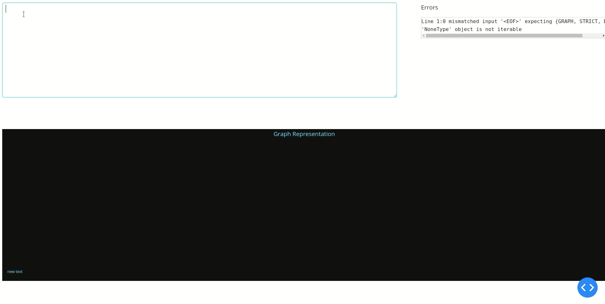

# DOT Implementation with ANTLR
**This project is a Compiler Lab (Winter 2020) Project of [Bachelor's Degree of Computer Engineering, Bu-Ali Sina University](http://eng.basu.ac.ir/en/ce)**
In this Project, a simple version of the DOT language is implemented using ANTLR.  
### What is DOT?
DOT is a DSL(domain-specific language) that can describe graphs, either directed or non directed. This is an example of DOT executed with dot2tex(a console program).

### What is ANTLR?
ANTLR is a parser generator, a tool that helps you to create a parser. For the installation of ANTLR on your platform, click [here](https://www.antlr.org/index.html).
## Phase #1(Defining Grammar)
The grammar is defined with respect to [https://graphviz.org/doc/info/lang.html](https://graphviz.org/doc/info/lang.html).This is the [lexer](src/antlr/DOTLexer.g4) and this is the [parser](src/antrl/DOTParser.g4) rules in ANTLR format.

### Parse Tree Represntation
To see if the parse tree is created in a way that we want, we can test it against some inputs. This is how you do it:
```
\\ Lines proceded by $ are command
\\ Lines proceded by > are inpu
$ antlr4 *.g4 -o test
$ javac DOT*.java
$ grun DOT graph
> digraph G {
> subgraph cluster0 {
> style=filled;
> a0 -> a1;
> label = "1";
> }
> subgraph cluster1 {
> node [style=filled];
> b0 -> b1 -> b2 -> b3;
> label = "2";
> }
> start -> a0;}
```
This is the respected output of the above, that has executed in terminal:


## Phase #2 (setting up the listener)
In this phase, a python listener for DOT language will
be generated. To make things faster and cleaner for running the command to generate the parser using the ANTLR tool, a Gradle script is used. Click [here](build.gradle) to see the code.
```
./gradlew generateparser
```
This command generates a lexer and parser file in python, and a listener template file is called [DOTParserListener.py](src/main-generated/DOTParserListener.py). We override its function in another file called [GraphDOTListener.py](src/main-genrated/GraphDOTListener.py) rather than changing its code directly. This is a simple Listener that supports some features of the DOT Language. It uses a python package is called **Networkx** for representing and manipulating the graph. There is a simple method in the GraphDOTListener class that uses Matplotlib to show the graph with the use of Netwrokx draw function.

[main.py](src/main-generated/main.py) is a simple programm that gets input file from the system input and uses the listener to show the result. This is a simple input and its output.


## Phase #3(Web application)
In this Phase, a simple web application is implemented with the use of [Dash](https://dash.plotly.com/).
To run the app, first install the required packages using the following command:
```
pip install -r requirements.txt
```
Then run the [src/main-generated/web-app.py](src/main-generated/web-app.py) using following command:
```
python src/main-generated/web-app.py
```
Then open the following url is shown in the terminal. this is how the application work-->

