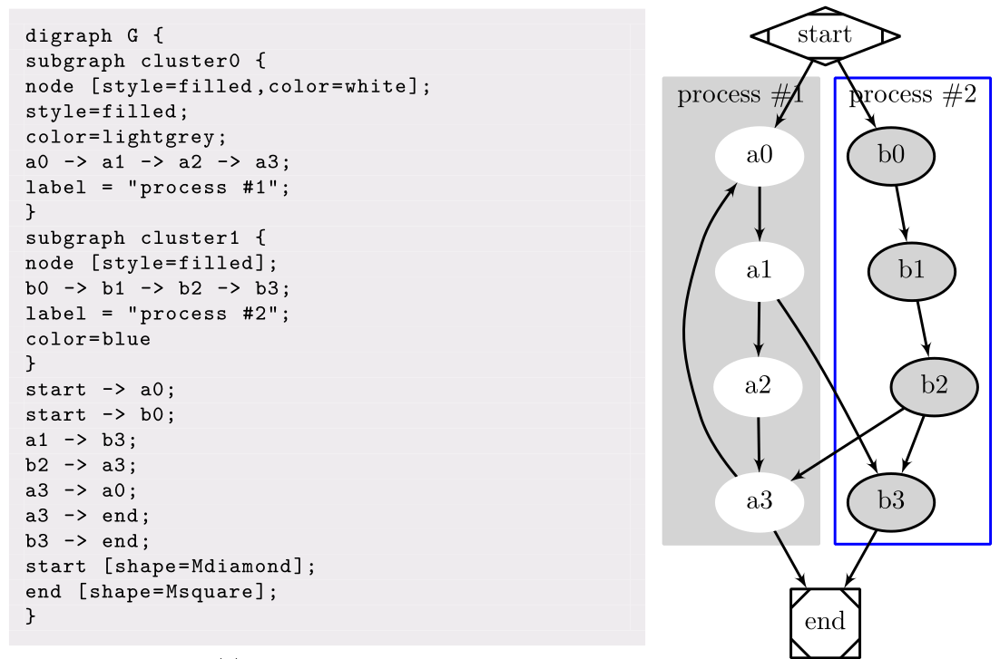
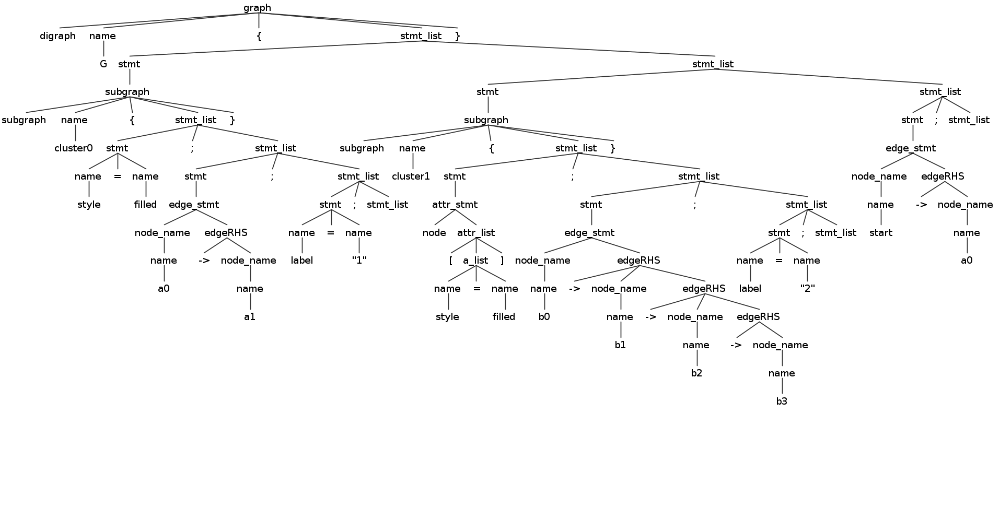
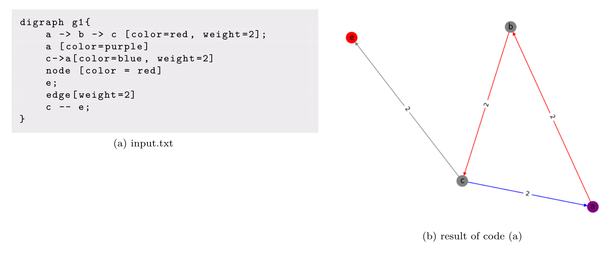

# DOT Implementation with ANTLR
In this Project we are going to implement DOT language using ANTLR. 
### What is DOT?
DOT is a DSL(domain specific language) that can describe graphs, either directed or non directed. This is example of DOT executed with dot2tex(a console program).

### What is ANTLR?
ANTLR is a parser generator, a tool that helps you to create parser. for installation of ANTLR on your platform click [here](https://www.antlr.org/index.html).
## Phase #1(Defining Grammar)
The grammar is defined with respect to [https://graphviz.org/doc/info/lang.html](https://graphviz.org/doc/info/lang.html).This is the [lexer](src/antlr/DOTLexer.g4) and this is the [parser](src/antrl/DOTParser.g4) rules in ANTLR format.

### Parse Tree Represntation
To see if the parse tree is created in a way that we want you can test it against some inputs. This is how you do it:
```
\\ Lines proceded by $ are command
\\ Lines proceded by > are inpu
$ antlr4 *.g4 -o test
$ javac DOT*.java
$ grun DOT graph
> digraph G {
> subgraph cluster0 {
> style=filled;
> a0 -> a1;
> label = "1";
> }
> subgraph cluster1 {
> node [style=filled];
> b0 -> b1 -> b2 -> b3;
> label = "2";
> }
> start -> a0;}
```
This is the respected output of the above, that has executed in terminal:


## Phase #2 (setting up the listener)
In this phase a python listener for DOT language will
be generated. To make things more faster and cleaner for running the command to generate the parser using ANTLR tool a gradle script is used. clike [here](build.gradle) to see the code.
```
./gradlew generateparser
```
This causes generation of lexer and parser file in python and a listener template file is called [DOTParserListener.py](src/main-generated/DOTParserListener.py). We override its function in another file called [GraphDOTListener.py](src/main-genrated/GraphDOTListener.py) rather than changing its code directly. This is a simple Listener that support some features of the DOT Language. It uses a python package is called **networkx** for representing and manipulating the graph. There is a simple method in the GraphDOTListener class that uses matplotlib to show the graph using with use of netwrokx draw function.

[main.py](src/main-generated/main.py) is simple programm that get input file from the system input and use the listener to show the result. This is simple input and its respected output.

